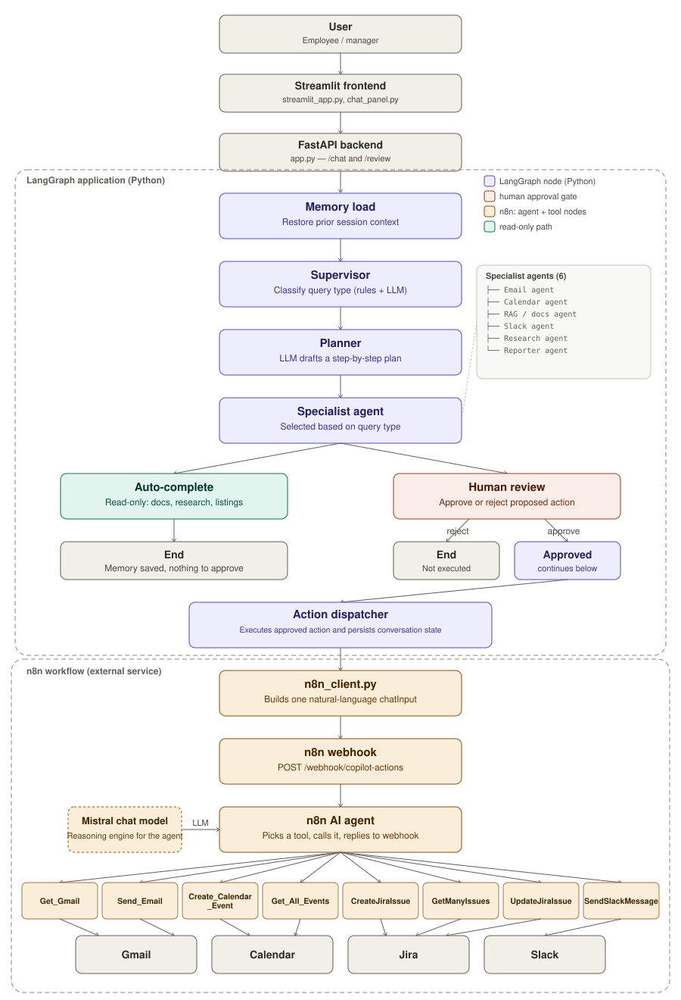

# Enterprise AI Knowledge Worker Copilot

An AI-powered enterprise assistant that helps employees and managers interact with organizational knowledge and automate common workplace tasks through a secure, multi-agent architecture.

The system combines **LangGraph, LangChain, Groq LLMs, Retrieval-Augmented Generation (RAG), ChromaDB, Sentence Transformers, PostgreSQL, FastAPI, Streamlit, Docker, and n8n** to provide an intelligent workplace assistant.

It supports enterprise document retrieval, AI-powered task planning, email and calendar automation, research workflows, human approval for sensitive actions, role-based access, and persistent conversation state.

---

## 🚀 Key Features

### 🤖 Multi-Agent AI Architecture

- Supervisor-based request routing
- Planner-driven task execution
- Specialized agents for different workplace tasks
- Stateful LangGraph workflows
- Groq-hosted LLM inference
- Modular agent architecture

### 📚 Enterprise Knowledge & RAG

- Retrieval-Augmented Generation for company documents
- ChromaDB vector database
- Sentence Transformers embeddings
- Metadata-based role-aware document retrieval
- Employee and manager access control
- Company policy and internal knowledge question answering

### 📧 Workplace Automation

- Read and analyze work-related emails
- Draft and send emails
- Broadcast email communication
- Google Calendar lookup and event creation
- Slack messaging and notifications
- n8n-powered external workflow execution
- Jira tool nodes exist in the n8n workflow (`CreateJiraIssue`, `GetManyIssues`, `UpdateJiraIssue`)

### 🔐 Human-in-the-Loop

Sensitive actions can be paused before execution.

The system supports:

- Action proposal generation
- Human review
- Approve / Reject decisions
- Optional reviewer comments
- Resume execution after approval
- Prevention of unauthorized downstream actions

### 🧠 Persistent Memory

- Conversation history and session state, stored in **PostgreSQL** (`agent_state`, `action_log` tables)
- Semantic memory (past reports, email summaries, RAG context), stored in **ChromaDB**
- LangGraph checkpoints
- Context-aware multi-step workflows

> **Known limitation:** `memory_save_node` only persists a run when `approved` is `True`. Read-only requests (document/research/listing queries) never go through human review, so `approved` stays unset for them — meaning those runs currently skip the PostgreSQL/ChromaDB save entirely, despite the auto-complete path calling the same save function. Worth fixing if read-only history is expected to persist.

### 👥 Role-Based Access

The application provides separate workspaces for:

- **Manager**
- **Employee**

Managers can access document-management functionality, while employees interact with the assistant according to their assigned permissions.

### 🌐 Web Interface

The application provides a Streamlit interface with:

- Secure role-based login
- AI Assistant workspace
- Company Knowledge (RAG) mode
- AI Agent (Automation) mode
- Chat history
- Human approval interface
- Manager document-management panel
- Employee profile interface

---

# 🏗️ System Architecture

The system follows a **Streamlit → FastAPI → LangGraph Supervisor** pipeline. Sensitive actions are only sent to n8n *after* human approval — nothing external runs before that gate.

**Flow summary:**

1. **User** (employee or manager) submits a request through the **Streamlit** frontend (`streamlit_app.py`, `chat_panel.py`).
2. **FastAPI** (`app.py`) receives it via `/chat` and invokes the LangGraph app built by `build_supervisor_graph()`.
3. **Memory load** (`memory_load_node`) restores prior session context — recent Postgres state plus semantically similar past reports from ChromaDB.
4. **Supervisor** classifies the request's query type using keyword rules with an LLM fallback (Groq).
5. **Planner** drafts a short execution plan for the classified type.
6. Exactly **one specialist agent** runs, chosen by query type — a single branch, not a chain of agents:
   - Email agent
   - Calendar agent
   - RAG / docs agent
   - Slack agent
   - Research agent
   - Reporter agent *(a shared helper other agents call to draft report text — not itself a routing destination)*
7. The graph branches on whether the action has side effects:
   - **Read-only requests** (documents, research, listings) auto-complete with no approval step.
   - **Actions with side effects** (send email, create event, post to Slack, etc.) pause for **human review**, showing the proposed action for approval.
8. On **reject**, nothing executes and the graph ends — no memory is saved for that run.
9. On **approve**, the **action dispatcher** (`memory_save_node`) executes the approved action and persists the run to PostgreSQL + ChromaDB.
10. Approved actions are handed to **n8n**: `n8n_client.py` builds one natural-language instruction and POSTs it to a single webhook; an **n8n AI agent** (backed by a Mistral chat model) picks the right tool node — Gmail, Calendar, or Slack today; Jira tool nodes exist but aren't yet wired up from the app side.

---

## 🗂️ Tech Stack

| Layer | Technology |
|---|---|
| Frontend | Streamlit |
| API | FastAPI |
| Orchestration | LangGraph, LangChain |
| LLM inference | Groq |
| Vector store | ChromaDB, Sentence Transformers |
| Structured memory | PostgreSQL |
| External workflow execution | n8n (Mistral-backed AI agent + tool nodes) |
| Deployment | Docker |